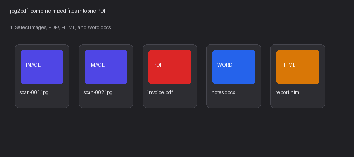
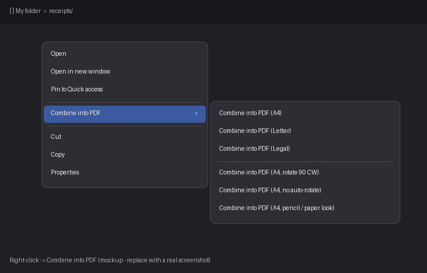

<div align="center">

# 📄 img-pdf

**Turn a folder of images into one beautiful PDF — in a single command.**

Cross-platform CLI · Quality-preserving · Windows right-click integration · Pencil-sketch mode for faint text

[](https://github.com/alimtvnetwork/img-pdf/releases)
[](https://github.com/alimtvnetwork/img-pdf/releases)
[](#license)

<br/>


</div>

---

## ✨ What it does

`jpg2pdf` walks a folder of images and stitches them into **one** PDF — preserving
quality, respecting orientation, and handling page sizing for you. No more
opening 30 images one-by-one, "Print to PDF", merging, repeat.

| Feature | Why it matters |
| --- | --- |
| 🖼️  **Quality-preserving** | Embeds the original JPEG bytes when possible — no recompression artifacts. |
| 📐 **Smart sizing** | `a4`, `letter`, `legal` — with `fit cover/contain` and `--orientation`. |
| ✏️  **Pencil mode** | Faint pencil-on-paper styling with **subtle / normal / extra-visible** depth. |
| 🪟 **Windows context-menu** | Right-click any folder → *"Combine into PDF"*. One terminal, all files. |
| 🍎 **macOS / Linux** | Drops into `~/.local/bin`; macOS falls back to Python source while binary runners are disabled. |
| 🔁 **Recursive** | `--recursive` walks subfolders in natural sort order. |

---

## 🚀 Install

### 🪟 Windows · PowerShell

```powershell
irm https://raw.githubusercontent.com/alimtvnetwork/img-pdf/main/install.ps1 | iex
```

Drops `jpg2pdf.exe` into `%USERPROFILE%\Tools\bin`, adds it to your **User PATH**,
and registers the Explorer right-click entries. Open a new terminal afterwards.

### 🪟 Windows · PowerShell · skip context-menu registration

```powershell
& ([scriptblock]::Create((irm https://raw.githubusercontent.com/alimtvnetwork/img-pdf/main/install.ps1))) -NoContextMenu
```

### 🪟 Windows · PowerShell · pin a specific version

```powershell
$env:JPG2PDF_VERSION = "v1.3.7"; irm https://raw.githubusercontent.com/alimtvnetwork/img-pdf/main/install.ps1 | iex
```

### 🐧 macOS · Linux · Bash

```bash
curl -fsSL https://raw.githubusercontent.com/alimtvnetwork/img-pdf/main/install.sh | bash
```

Drops `jpg2pdf` into `~/.local/bin` (override with `JPG2PDF_PREFIX=$HOME/bin`). If no macOS binary exists, the installer downloads the Python source, installs dependencies best-effort, and writes a `jpg2pdf` wrapper instead of failing.

For installer diagnostics, add `--debug` or `JPG2PDF_DEBUG=1`. The installer prints a `jpg2pdf-install-*.log` path and leaves any Python fallback wrapper in place even if dependency verification fails.

### 🐧 macOS · Linux · Bash · pin a specific version

```bash
curl -fsSL https://raw.githubusercontent.com/alimtvnetwork/img-pdf/main/install.sh \
  | JPG2PDF_VERSION=v1.3.7 JPG2PDF_PREFIX=$HOME/bin bash
```

If PowerShell blocks scripts, use a process-only bypass for the current shell first:

```powershell
Set-ExecutionPolicy -Scope Process -ExecutionPolicy Bypass -Force
irm https://raw.githubusercontent.com/alimtvnetwork/img-pdf/main/install.ps1 | iex
```

Or run the installer inside a bypassed PowerShell process:

```powershell
powershell.exe -NoProfile -ExecutionPolicy Bypass -Command "irm https://raw.githubusercontent.com/alimtvnetwork/img-pdf/main/install.ps1 | iex"
```

After installation, open a new terminal and run `jpg2pdf --help`, or right-click any folder in Explorer and pick *Combine images into PDF*.

### 🧹 Uninstall

```powershell
irm https://raw.githubusercontent.com/alimtvnetwork/img-pdf/main/uninstall.ps1 | iex
```

> Env var overrides: `JPG2PDF_VERSION` (pin a tag), `JPG2PDF_REPO` (use a fork),
> `JPG2PDF_NO_CONTEXT_MENU=1` (skip Explorer entries), `JPG2PDF_PREFIX` (custom
> install dir on macOS / Linux).

---

## 🎯 Use it

```bash
# The basics
jpg2pdf ~/Pictures --size a4
jpg2pdf .         --size letter --fit cover --out album.pdf
jpg2pdf .         --size legal  --orientation landscape --recursive

# Mixed selections — images + PDFs + HTML + Word, merged in selection order
jpg2pdf --files cover.jpg invoice.pdf notes.docx report.html --out bundle.pdf

# Pencil-on-paper styling for scanned notes / faint handwriting
jpg2pdf ./notes --size a4 --style pencil
jpg2pdf ./notes --size a4 --style pencil --ask-strength   # live preview, defaults to subtle
```

Supported inputs (sorted naturally; mixed selections merged in order):

| Kind  | Extensions                              | Notes |
|-------|------------------------------------------|-------|
| Image | `.jpg .jpeg .png .webp .bmp .tif .tiff` | Honors `--size/--fit/--style/...` |
| PDF   | `.pdf`                                   | Embedded as-is, page geometry preserved |
| HTML  | `.html .htm`                             | Rendered via `xhtml2pdf` |
| Word  | `.docx .doc`                             | Needs MS Word (Windows) or LibreOffice (macOS) |

<div align="center">
  
</div>

### ✏️ Pencil strength — three depths

| Mode | When to use |
| --- | --- |
| `subtle`         | **Default.** Gentle softening that keeps paper texture — best for already-readable scans. |
| `normal`         | Balanced ink + paper grain. |
| `extra-visible`  | Faint / low-contrast handwriting that needs pop. |

Pick interactively with `--ask-strength` (live preview, opens with **subtle**
selected), or pass `--pencil-opacity` / `--pencil-ink-darken` for full manual
control. Your last choice is saved to `~/.jpg2pdf/config.json` and reused
automatically next run.

---

## 🪟 Windows right-click

After install, right-click works two ways — both route through a **single terminal**:

- **On a folder** → *Combine into PDF* / *Combine into PDF (pencil)*
- **On selected files** → mix images, PDFs, HTML, and Word docs in any order; they're merged into one PDF

No more 30 terminals popping up for 30 selected files. The launcher batches
everything into one conversion call.

<div align="center">
  
</div>

---

## 🛠️ Build from source

```bash
pip install -r tools/jpg2pdf/requirements.txt
python tools/jpg2pdf/src/jpg2pdf.py ./photos --size a4
```

---

## 📦 Repo layout

```text
img-pdf/
├── install.ps1                          # one-liner Windows installer
├── install.sh                           # one-liner macOS / Linux installer
├── run.ps1 / uninstall.ps1              # local runner + uninstaller
└── tools/jpg2pdf/
    ├── src/jpg2pdf.py                   # the CLI
    ├── scripts/register-context-menu.ps1
    ├── spec/SPEC.md                     # full spec
    ├── docs/hero.png
    ├── requirements.txt
    └── VERSION
```

---

## 🚢 Cutting a release

Tag & push — GitHub Actions builds binaries for Windows and Linux and publishes
a Release with `SHA256SUMS.txt`. macOS installs use the Python source fallback
until macOS runners are restored:

```bash
git tag v1.3.7 && git push origin v1.3.7
```

Released artifacts: `jpg2pdf-windows-x64.exe`, `jpg2pdf-linux-x64`,
`jpg2pdf-linux-arm64`.

---

## License

MIT © [alimtvnetwork](https://github.com/alimtvnetwork)
