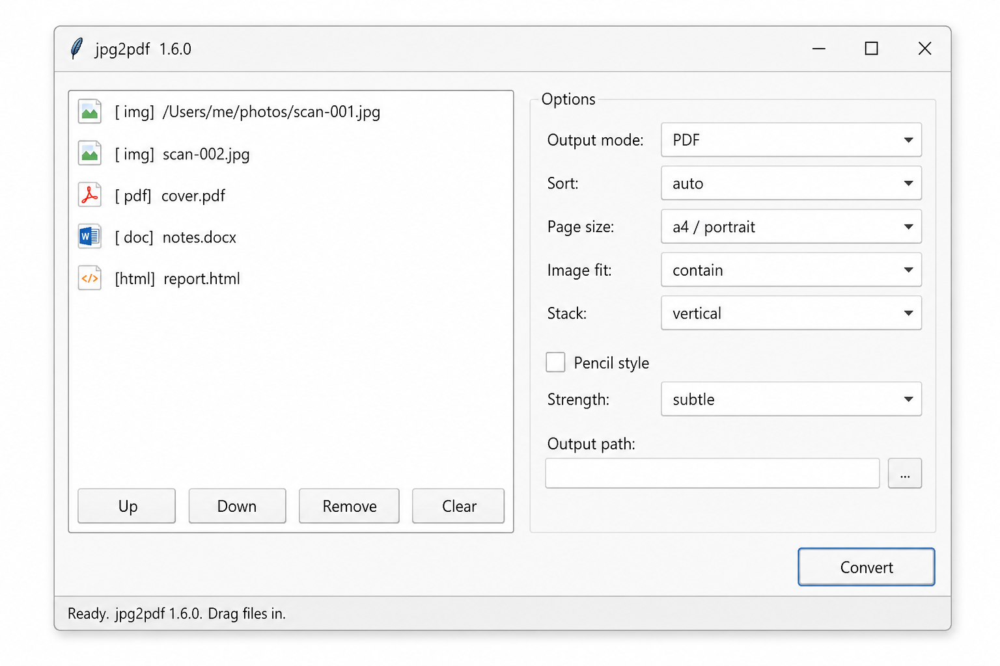

# jpg2pdf

Combine images, PDFs, HTML and Word documents into a single PDF — or stack
images into one tall/wide PNG. Quality-preserving, cross-platform, ships
both a CLI and a desktop GUI.



See [`spec/SPEC.md`](spec/SPEC.md) and [`spec/GUI.md`](spec/GUI.md) for the full specs.

## Install — one-liner (prebuilt binaries from GitHub Releases)

Override the repo at any time with `JPG2PDF_REPO=other-user/other-repo` (env var).

### Windows (PowerShell)

```powershell
irm https://raw.githubusercontent.com/alimtvnetwork/img-pdf-v2/main/install.ps1 | iex
```

Drops `jpg2pdf.exe` + `jpg2pdf-gui.exe` into `%USERPROFILE%\Tools\bin`, adds
that folder to **User PATH**, creates Start-menu and Desktop shortcuts for
the GUI, and registers a grouped Explorer right-click menu (`Combine into
PDF` -> `PDF` / `Image` submenus). Open a new terminal afterwards.

Pin a version or skip optional pieces:

```powershell
$env:JPG2PDF_VERSION         = "v1.6.0"; irm ... | iex
$env:JPG2PDF_NO_CONTEXT_MENU = "1";      irm ... | iex   # skip Explorer menu
$env:JPG2PDF_NO_GUI          = "1";      irm ... | iex   # CLI only
$env:JPG2PDF_NO_SHORTCUTS    = "1";      irm ... | iex   # CLI + GUI, no shortcuts
```

### macOS / Linux (curl)

```bash
curl -fsSL https://raw.githubusercontent.com/alimtvnetwork/img-pdf-v2/main/install.sh | bash
```

Installs `jpg2pdf` + `jpg2pdf-gui` to `$HOME/.local/bin` (override with
`JPG2PDF_PREFIX`). The script tells you the exact `export PATH=...` line if
that folder isn't on `PATH` yet. Source-fallback wrappers stay installed
even when dependency verification needs repair.

What you get **on macOS**:
- `jpg2pdf.app` in `/Applications` (or `~/Applications` when the system
  folder isn't writable), built from PyInstaller `--windowed`.
- Four Quick Actions in Finder under **Services -> Combine into PDF
  (A4 / Letter / Legal / A4 pencil)**, accepting images, PDFs, HTML and
  Word selections.

What you get **on Linux**:
- A `jpg2pdf.desktop` entry under `~/.local/share/applications/` so the GUI
  shows up in the Applications menu and as a file-handler for the
  supported mime types.
- Nautilus right-click scripts under `~/.local/share/nautilus/scripts/`.
- A KDE Dolphin servicemenu at
  `~/.local/share/kio/servicemenus/jpg2pdf.desktop` with a
  `Combine into PDF` submenu (A4 / Letter / Legal / Pencil).

Skip flags (any combination, value `1`):

| Variable | Effect |
|----------|--------|
| `JPG2PDF_NO_GUI` | Don't install GUI binary or app/shortcuts/desktop entry. |
| `JPG2PDF_NO_APP` | Skip macOS `.app` bundle. |
| `JPG2PDF_APP_USER_ONLY` | Force `.app` install into `~/Applications`. |
| `JPG2PDF_NO_QUICKACTION` | Skip macOS Finder Quick Actions. |
| `JPG2PDF_NO_DESKTOP` | Skip Linux `.desktop` entry. |
| `JPG2PDF_NO_FM_ACTIONS` | Skip Linux Nautilus + KDE servicemenu actions. |
| `JPG2PDF_NO_SHORTCUTS` | Skip Windows Start-menu / Desktop shortcuts. |
| `JPG2PDF_NO_CONTEXT_MENU` | Skip Windows Explorer context menu. |

> **macOS signing:** binaries are **ad-hoc signed** (not Apple-notarized).
> The installer auto-strips `com.apple.quarantine`. If you download a
> `.zip` from the Releases page manually, run once:
> `xattr -dr com.apple.quarantine ~/.local/bin/jpg2pdf`

## Desktop GUI

Launch:

```bash
jpg2pdf-gui            # standalone binary
jpg2pdf --gui          # via the CLI
python -m jpg2pdf_app  # from a source checkout
```

Features (see [`spec/GUI.md`](spec/GUI.md)):

- Drag-and-drop, or **File -> Add files / Add folder**.
- Reorderable list with **Up / Down / Remove / Clear** — selection order
  controls page order in the merged PDF.
- Output options: mode (PDF, Stacked Image, Pencil PDF, Pencil Image),
  sort, page size + orientation, image fit, stack direction, pencil style
  with strength preset (`subtle` is the project default), and a custom
  output path.
- **File -> Recent** keeps the last 12 input paths, deduped. Selecting one
  re-queues it.
- Presets and the recent-files list persist between sessions in
  `%APPDATA%\jpg2pdf\settings.json` (Windows),
  `~/Library/Application Support/jpg2pdf/settings.json` (macOS), or
  `$XDG_CONFIG_HOME/jpg2pdf/settings.json` (Linux).

## Windows Explorer context menu


After install, right-click any folder, folder background, image, PDF,
HTML or Word document. The top-level **Combine into PDF** entry expands
into two grouped submenus:

- **PDF**: A4, Letter, Legal (folder mode also gets *A4 (recursive)*).
- **Image**: A4 rotated 90 CW / CCW / 180, A4 with no auto-rotate, and
  A4 with the pencil/paper look.

Selected-file verbs queue per-file Explorer invocations into
`%LOCALAPPDATA%\jpg2pdf\queue\*.lst` via a single visible batch runner,
then call `jpg2pdf --files-from` once for the whole batch. The runner
logs to `%LOCALAPPDATA%\jpg2pdf\context.log` and pauses on non-zero exit
so errors stay readable.

## CLI use

```bash
# Image folders
jpg2pdf ~/Pictures --size a4
jpg2pdf . --size letter --fit cover --out album.pdf
jpg2pdf . --size legal --orientation landscape --recursive
jpg2pdf . --size a4 --style pencil           # faint pencil-on-paper look

# Mixed selections — merged in the order given
jpg2pdf --files cover.jpg invoice.pdf notes.docx report.html --out bundle.pdf

# Output modes
jpg2pdf --files a.jpg b.jpg c.jpg --output-mode image --out tall.png
jpg2pdf --files a.jpg b.jpg c.jpg --output-mode image --stack horizontal --out wide.png
jpg2pdf --files notes/*.jpg --output-mode pencil-image --out pencil.png
jpg2pdf ~/scans --output-mode pencil-pdf --out scans.pdf

# Sorting: selection | name | date | folder | auto
jpg2pdf ~/scans --sort date
jpg2pdf --files a.jpg b.jpg --sort name
```

Supported inputs (sorted naturally; mixed types merged in selection order):

| Kind  | Extensions                              | Notes |
|-------|------------------------------------------|-------|
| Image | `.jpg .jpeg .png .webp .bmp .tif .tiff` | Honors `--size/--fit/--style/...` |
| PDF   | `.pdf`                                   | Embedded as-is |
| HTML  | `.html .htm`                             | Rendered via `xhtml2pdf` |
| Word  | `.docx .doc`                             | Needs MS Word (Windows) or LibreOffice (macOS) |

## Build from source

```bash
pip install -r tools/jpg2pdf/requirements.txt
python tools/jpg2pdf/src/jpg2pdf.py ./photos --size a4
python -m jpg2pdf_app                     # GUI
python -m pytest -q tools/jpg2pdf/tests   # smoke suite
```

## Cutting a release

Tag and push — the workflow runs the pytest smoke suite, then builds CLI
and GUI binaries for Windows, Linux (x64 + arm64) and macOS (x64 + arm64)
plus a `.app` bundle, then publishes a GitHub Release:

```bash
git tag v1.6.0 && git push origin v1.6.0
```

## Repo layout

```
jpg2pdf/
├── spec/SPEC.md            # CLI specification
├── spec/GUI.md             # GUI specification
├── src/jpg2pdf.py          # CLI engine
├── src/jpg2pdf_app/        # GUI (gui.py, settings.py, core.py, ...)
├── scripts/                # PowerShell helpers (context menu, run.ps1, ...)
├── tests/                  # pytest smoke suite
├── docs/                   # screenshots
├── requirements.txt
└── README.md
```
